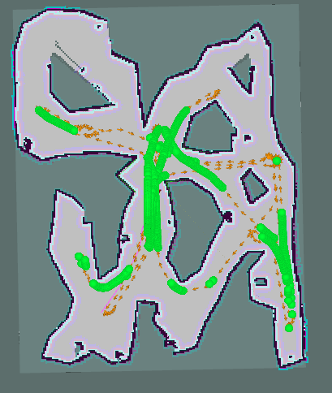

# Space Robotics Assignment 3

## Project
High level overview is:
- Build a vision dataset of artifacts of interest for training a computer vision model 
- Detect and localise artifacts of interest as the robot moves through the cave 
- Autonomously explore, navigate and patrol the cave 
- Perform close-range inspection of discovered artifacts
- Construct a topological roadmap of the cave

Tasks are further broken down as follows:

### Perception 1: Collect an image dataset of the artifacts
- **Goal**: Create a dataset of artefacts of interest in the cave (rock thing, aliens, etc) as well as control images (wall, images with nothing).
- Can collect RGB images
- Can collect depth images

#### Planning
- Ideas: 
    - Create a python subscriber to listen to the image publisher and to dump the image to a designated image dump every set amount of time.
    - Let the robot do its default autonomous navigation through the cave to collect a baseline set of images. 

- Topics of interest:
    - `/camera/depth/image [sensor_msgs/msg/Image]`
    - `/camera/image [sensor_msgs/msg/Image]`

#### Progress 1
A new node `CameraProcessor` was created as a seperate ROS package to both learn more about ROS based development as well as to achieve the objective of collecting images to serve as training data.

An initial pass was done allowing the defualt random walk model to autonomously explore the cave. Through this, the `CameraProcessor` node listened for images every 3 seconds and saved them to a local folder.

This path taken from this initial pass is seen below:


In total `268` images were collected in this first pass.

### Perception 2: Detect artifacts with computer vision
- **Goal**: Create a computer vision model to detect the above artefacts.
- Can use RGB camera and Depth camera

### Perception 3: Artifact localisation and display
- **Goal**: Estimate the location of the detected artefacts on the world map.
- Potential approaches:
    - Estimate direction from the pixel coordinates of the detection
    - Estimate distance using the depth camera
- Handle multiple detections

### Planning 1: Autonomously explore the cave
- **Goal**: Robot to explore cave and build map of new areas.
- aka reduce the number of unknown/unobserved grids/pixels on the map if that grid/pixel does not have an obstacle and is hence traversable.

### Planning 2: Close-range inspection
- **Goal**: Upon detection of an artefacte, pause exploration, generate a path to the artefact and navigate to it.

### Planning 3: Behaviour switching
- **Goal**: Alternate between exploration and inspection. Inspect new artefacts whilst not inspecting already inspected artefacts.

### Advanced 1: Robust perception
- **Goal**: Extend your solution and analysis from Perception 1-3 for environments with additional perceptual challenges. Apply degrading visual effects to the images received in cave_explorer.py, then feed these degraded images into your computer vision pipeline.
- Aim is to simulate Martian conditions. Examples include dust, poor lighting, low-quality cameras, dirty lenses, or motion blur.

### Advanced 2: Cave geometry analysis
- **Goal**: Extend your system to perform online analysis of cave geometry while exploring. Automatically identify regions of interest such as the widest open areas (potentially suitable for future human habitation) and narrow passages (critical for navigation and hazard assessment).

### Advanced 3: Communication network deployment
- **Goal**: Extend your system so that the robot maintains a multi-hop communication link back to the start location throughout its mission. The robot is able to deploy communication relay nodes in the cave, with the assumption that each node can connect to others via line-of-sight communication up to a fixed distance.

### Advanced 4: Online roadmap construction
- **Goal**: Build a navigation roadmap online as the robot explores the Martian cave.

### Advanced 5: Persistent monitoring
- **Goal**: Repeatedly visit a set of key points in the environment.

## Dependencies
```sh
sudo apt update  
sudo apt install ros-humble-ros-ign-bridge ros-humble-ros-ign-gazebo  
sudo apt install ros-humble-robot-localization  
sudo apt install ros-humble-slam-toolbox ros-humble-navigation2 ros-humble-nav2-bringup
sudo apt install ros-humble-xacro
```

## Set ROS Environment
```sh
source /opt/ros/humble/setup.bash
```

## Building
```sh
cd ros_workspace

colcon build --symlink-install --packages-select cave_explorer

source install/setup.bash
```

## Executing Launch Files
The first launch file is `cave_explorer_startup.launch.py`, which launches the Gazebo simulator containing the robot and cave world, as well as the RVIZ visualisation window.
```sh
ros2 launch cave_explorer cave_explorer_startup.launch.py
```

NOTE: Due to some issues with WSL and Gazebo, normal launch may not work and hence you might need to use software rendering, so launch the startup file like this instead:
```sh
LIBGL_ALWAYS_SOFTWARE=1 ros2 launch cave_explorer cave_explorer_startup.launch.py
```

The second launch file is `cave_explorer_navigation.launch.py`, which launches some basic navigation capabilities including mapping and the Nav2 path planner pipeline for navigating around the environment.
```sh
ros2 launch cave_explorer cave_explorer_navigation.launch.py
``` 
    
The third and final launch file is `cave_explorer_autonomy.launch.py`, which launches the ROS node coded in `cave_explorer/cave_explorer.py`.
```sh
ros2 launch cave_explorer cave_explorer_autonomy.launch.py
```

### New Launch Files
#### Camera Processor
This executes the new camera listener node that was created to take in data from the camera sensor.
```sh
ros2 run camera_processor listener
```

# Project Notes

## return of `ros2 node list`:
```
/behavior_server
/bt_navigator
/bt_navigator_navigate_through_poses_rclcpp_node
/bt_navigator_navigate_to_pose_rclcpp_node
/cave_explorer_node
/controller_server
/global_costmap/global_costmap
/lifecycle_manager_navigation
/local_costmap/local_costmap
/planner_server
/robot_localization
/robot_state_publisher
/ros_gz_bridge
/rviz
/rviz_navigation_dialog_action_client
/slam_toolbox
/smoother_server
/transform_listener_impl_55a5f2ca2a50
/transform_listener_impl_55cf41a87e30
/transform_listener_impl_55d1e5448240
/transform_listener_impl_55efc097b8c0
/transform_listener_impl_5603094c3240
/transform_listener_impl_56053995b7f0
/transform_listener_impl_5627c7bef220
/velocity_smoother
/waypoint_follower
```

## return of `ros2 topic list`:
```
/behavior_server/transition_event
/behavior_tree_log
/bond
/bt_navigator/transition_event
/camera/depth/image
/camera/image
/clicked_point
/clock
/cmd_vel
/cmd_vel_nav
/cmd_vel_teleop
/controller_server/transition_event
/cost_cloud
/detections_image
/diagnostics
/evaluation
/global_costmap/costmap
/global_costmap/costmap_raw
/global_costmap/costmap_updates
/global_costmap/footprint
/global_costmap/global_costmap/transition_event
/global_costmap/published_footprint
/goal_pose
/imu
/initialpose
/joint_states
/local_costmap/costmap
/local_costmap/costmap_raw
/local_costmap/costmap_updates
/local_costmap/footprint
/local_costmap/local_costmap/transition_event
/local_costmap/published_footprint
/local_plan
/map
/map_metadata
/map_updates
/marker
/marker_array_artifacts
/odom
/odometry
/odometry/filtered
/parameter_events
/plan
/plan_smoothed
/planner_server/transition_event
/pose
/preempt_teleop
/received_global_plan
/robot_description
/rosout
/scan
/scan/points
/set_pose
/slam_toolbox/feedback
/slam_toolbox/graph_visualization
/slam_toolbox/scan_visualization
/slam_toolbox/update
/smoother_server/transition_event
/speed_limit
/tf
/tf_static
/transformed_global_plan
/velocity_smoother/transition_event
/waypoint_follower/transition_event
/waypoints
```

## return of `ros2 service list`:
```
/behavior_server/change_state
/behavior_server/describe_parameters
/behavior_server/get_available_states
/behavior_server/get_available_transitions
/behavior_server/get_parameter_types
/behavior_server/get_parameters
/behavior_server/get_state
/behavior_server/get_transition_graph
/behavior_server/list_parameters
/behavior_server/set_parameters
/behavior_server/set_parameters_atomically
/bt_navigator/change_state
/bt_navigator/describe_parameters
/bt_navigator/get_available_states
/bt_navigator/get_available_transitions
/bt_navigator/get_parameter_types
/bt_navigator/get_parameters
/bt_navigator/get_state
/bt_navigator/get_transition_graph
/bt_navigator/list_parameters
/bt_navigator/set_parameters
/bt_navigator/set_parameters_atomically
/bt_navigator_navigate_through_poses_rclcpp_node/describe_parameters
/bt_navigator_navigate_through_poses_rclcpp_node/get_parameter_types
/bt_navigator_navigate_through_poses_rclcpp_node/get_parameters
/bt_navigator_navigate_through_poses_rclcpp_node/list_parameters
/bt_navigator_navigate_through_poses_rclcpp_node/set_parameters
/bt_navigator_navigate_through_poses_rclcpp_node/set_parameters_atomically
/bt_navigator_navigate_to_pose_rclcpp_node/describe_parameters
/bt_navigator_navigate_to_pose_rclcpp_node/get_parameter_types
/bt_navigator_navigate_to_pose_rclcpp_node/get_parameters
/bt_navigator_navigate_to_pose_rclcpp_node/list_parameters
/bt_navigator_navigate_to_pose_rclcpp_node/set_parameters
/bt_navigator_navigate_to_pose_rclcpp_node/set_parameters_atomically
/cave_explorer_node/describe_parameters
/cave_explorer_node/get_parameter_types
/cave_explorer_node/get_parameters
/cave_explorer_node/list_parameters
/cave_explorer_node/set_parameters
/cave_explorer_node/set_parameters_atomically
/controller_server/change_state
/controller_server/describe_parameters
/controller_server/get_available_states
/controller_server/get_available_transitions
/controller_server/get_parameter_types
/controller_server/get_parameters
/controller_server/get_state
/controller_server/get_transition_graph
/controller_server/list_parameters
/controller_server/set_parameters
/controller_server/set_parameters_atomically
/enable
/global_costmap/clear_around_global_costmap
/global_costmap/clear_entirely_global_costmap
/global_costmap/clear_except_global_costmap
/global_costmap/get_costmap
/global_costmap/global_costmap/change_state
/global_costmap/global_costmap/describe_parameters
/global_costmap/global_costmap/get_available_states
/global_costmap/global_costmap/get_available_transitions
/global_costmap/global_costmap/get_parameter_types
/global_costmap/global_costmap/get_parameters
/global_costmap/global_costmap/get_state
/global_costmap/global_costmap/get_transition_graph
/global_costmap/global_costmap/list_parameters
/global_costmap/global_costmap/set_parameters
/global_costmap/global_costmap/set_parameters_atomically
/is_path_valid
/lifecycle_manager_localization/is_active
/lifecycle_manager_localization/manage_nodes
/lifecycle_manager_navigation/describe_parameters
/lifecycle_manager_navigation/get_parameter_types
/lifecycle_manager_navigation/get_parameters
/lifecycle_manager_navigation/is_active
/lifecycle_manager_navigation/list_parameters
/lifecycle_manager_navigation/manage_nodes
/lifecycle_manager_navigation/set_parameters
/lifecycle_manager_navigation/set_parameters_atomically
/local_costmap/clear_around_local_costmap
/local_costmap/clear_entirely_local_costmap
/local_costmap/clear_except_local_costmap
/local_costmap/get_costmap
/local_costmap/local_costmap/change_state
/local_costmap/local_costmap/describe_parameters
/local_costmap/local_costmap/get_available_states
/local_costmap/local_costmap/get_available_transitions
/local_costmap/local_costmap/get_parameter_types
/local_costmap/local_costmap/get_parameters
/local_costmap/local_costmap/get_state
/local_costmap/local_costmap/get_transition_graph
/local_costmap/local_costmap/list_parameters
/local_costmap/local_costmap/set_parameters
/local_costmap/local_costmap/set_parameters_atomically
/planner_server/change_state
/planner_server/describe_parameters
/planner_server/get_available_states
/planner_server/get_available_transitions
/planner_server/get_parameter_types
/planner_server/get_parameters
/planner_server/get_state
/planner_server/get_transition_graph
/planner_server/list_parameters
/planner_server/set_parameters
/planner_server/set_parameters_atomically
/robot_localization/describe_parameters
/robot_localization/get_parameter_types
/robot_localization/get_parameters
/robot_localization/list_parameters
/robot_localization/set_parameters
/robot_localization/set_parameters_atomically
/robot_state_publisher/describe_parameters
/robot_state_publisher/get_parameter_types
/robot_state_publisher/get_parameters
/robot_state_publisher/list_parameters
/robot_state_publisher/set_parameters
/robot_state_publisher/set_parameters_atomically
/ros_gz_bridge/describe_parameters
/ros_gz_bridge/get_parameter_types
/ros_gz_bridge/get_parameters
/ros_gz_bridge/list_parameters
/ros_gz_bridge/set_parameters
/ros_gz_bridge/set_parameters_atomically
/rviz/describe_parameters
/rviz/get_parameter_types
/rviz/get_parameters
/rviz/list_parameters
/rviz/set_parameters
/rviz/set_parameters_atomically
/rviz_navigation_dialog_action_client/describe_parameters
/rviz_navigation_dialog_action_client/get_parameter_types
/rviz_navigation_dialog_action_client/get_parameters
/rviz_navigation_dialog_action_client/list_parameters
/rviz_navigation_dialog_action_client/set_parameters
/rviz_navigation_dialog_action_client/set_parameters_atomically
/set_pose
/slam_toolbox/clear_changes
/slam_toolbox/describe_parameters
/slam_toolbox/deserialize_map
/slam_toolbox/dynamic_map
/slam_toolbox/get_interactive_markers
/slam_toolbox/get_parameter_types
/slam_toolbox/get_parameters
/slam_toolbox/list_parameters
/slam_toolbox/manual_loop_closure
/slam_toolbox/pause_new_measurements
/slam_toolbox/save_map
/slam_toolbox/serialize_map
/slam_toolbox/set_parameters
/slam_toolbox/set_parameters_atomically
/slam_toolbox/toggle_interactive_mode
/smoother_server/change_state
/smoother_server/describe_parameters
/smoother_server/get_available_states
/smoother_server/get_available_transitions
/smoother_server/get_parameter_types
/smoother_server/get_parameters
/smoother_server/get_state
/smoother_server/get_transition_graph
/smoother_server/list_parameters
/smoother_server/set_parameters
/smoother_server/set_parameters_atomically
/toggle
/velocity_smoother/change_state
/velocity_smoother/describe_parameters
/velocity_smoother/get_available_states
/velocity_smoother/get_available_transitions
/velocity_smoother/get_parameter_types
/velocity_smoother/get_parameters
/velocity_smoother/get_state
/velocity_smoother/get_transition_graph
/velocity_smoother/list_parameters
/velocity_smoother/set_parameters
/velocity_smoother/set_parameters_atomically
/waypoint_follower/change_state
/waypoint_follower/describe_parameters
/waypoint_follower/get_available_states
/waypoint_follower/get_available_transitions
/waypoint_follower/get_parameter_types
/waypoint_follower/get_parameters
/waypoint_follower/get_state
/waypoint_follower/get_transition_graph
/waypoint_follower/list_parameters
/waypoint_follower/set_parameters
/waypoint_follower/set_parameters_atomically
```

## return of `ros2 action list`:
```
/assisted_teleop
/backup
/compute_path_through_poses
/compute_path_to_pose
/drive_on_heading
/follow_path
/follow_waypoints
/navigate_through_poses
/navigate_to_pose
/smooth_path
/spin
/wait
```