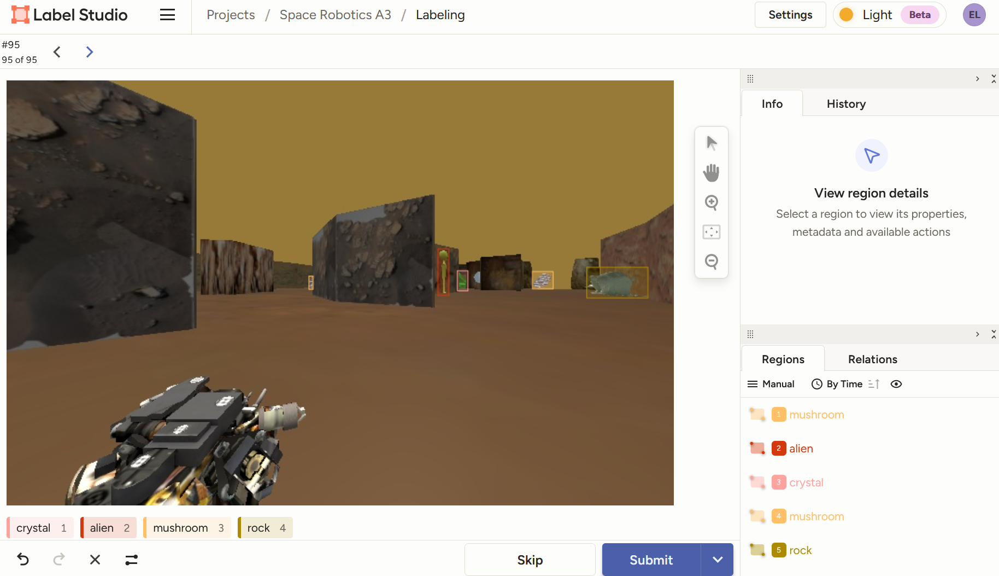
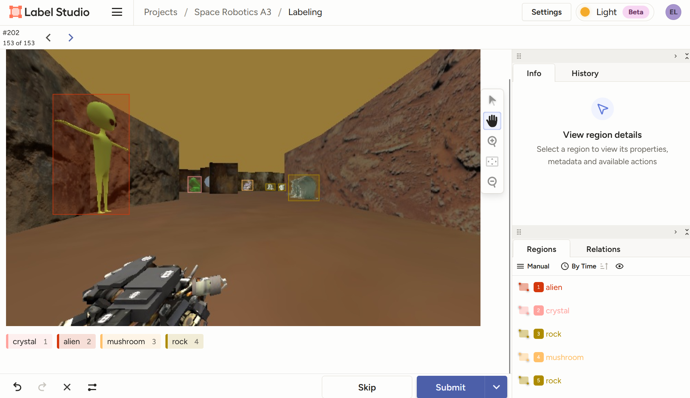
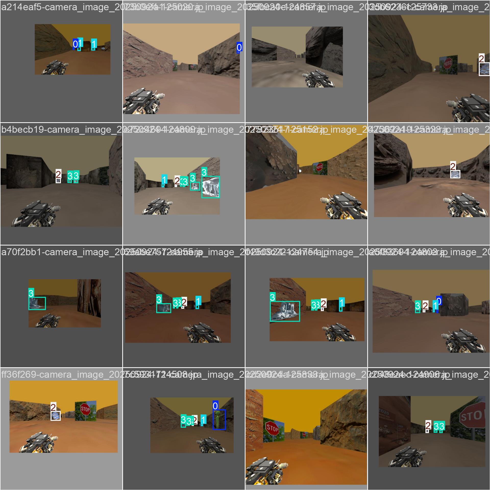

# Space Robotics Assignment 3

## Project
High level overview is:
- Build a vision dataset of artifacts of interest for training a computer vision model 
- Detect and localise artifacts of interest as the robot moves through the cave 
- Autonomously explore, navigate and patrol the cave 
- Perform close-range inspection of discovered artifacts
- Construct a topological roadmap of the cave

Tasks are further broken down as follows:

### Perception 1: Collect an image dataset of the artifacts
- **Goal**: *Create a dataset of artefacts of interest in the cave (rock thing, aliens, etc) as well as control images (wall, images with nothing).*
- Can collect RGB images
- Can collect depth images

#### Planning
- Ideas: 
    - Create a python subscriber to listen to the image publisher and to dump the image to a designated image dump every set amount of time.
    - Let the robot do its default autonomous navigation through the cave to collect a baseline set of images. 

- Topics of interest:
    - `/camera/depth/image [sensor_msgs/msg/Image]`
    - `/camera/image [sensor_msgs/msg/Image]`

#### Progress 1
A new node `CameraProcessor` was created as a seperate ROS package to both learn more about ROS based development as well as to achieve the objective of collecting images to serve as training data.

An initial pass was done allowing the defualt random walk model to autonomously explore the cave. Through this, the `CameraProcessor` node listened for images every 3 seconds and saved them to a local folder.

This path taken from this initial pass is seen below:


In total `268` images were collected in this first pass. Currently we have only gathered images from the RGB camera and *not* the depth camera.

### Perception 2: Detect artifacts with computer vision
- **Goal**: *Create a computer vision model to detect the above artefacts.*
- Can use RGB camera and Depth camera

#### Progress 1
- Images were manually labelled using LabelStudio
- Labeled images were exported in yolo campatible format 
- Executed the yolo training process on a Google Colab runtime environment
- Saved the trained model, weights and some results

Annotation/labelling of data was done manually on the `268` images collected for the first pass. Example of annotations done can be seen below:





Annotated images were then imported into a Google Colab environment and split into training and validation folders.

The `ultralytics` package was installed to the environment's python runtime and training was executed using the command:
```sh
!yolo detect train data=/content/data.yaml model=yolo11s.pt epochs=60 imgsz=640
```

The model was then executed on the validatio nset using the commmand:
```sh
!yolo detect predict model=runs/detect/train/weights/best.pt source=data/validation/images save=True
```

Results from the model trained on the first pass images can be seen below:



The relevant weights and pytorch model was then downloaded from the Collab environment and stored in this repository as `model_1`.

Initial deployment of YOLO model to environmemt:

[](https://youtu.be/Pje4ALhp0z0)

### Perception 3: Artifact localisation and display
- **Goal**: *Estimate the location of the detected artefacts on the world map.*
- Potential approaches:
    - Estimate direction from the pixel coordinates of the detection
    - Estimate distance using the depth camera
- Handle multiple detections

### Planning 1: Autonomously explore the cave
- **Goal**: *Robot to explore cave and build map of new areas.*
- aka reduce the number of unknown/unobserved grids/pixels on the map if that grid/pixel does not have an obstacle and is hence traversable.

### Planning 2: Close-range inspection
- **Goal**: *Upon detection of an artefacte, pause exploration, generate a path to the artefact and navigate to it.*

### Planning 3: Behaviour switching
- **Goal**: *Alternate between exploration and inspection. Inspect new artefacts whilst not inspecting already inspected artefacts.*

I have Implimented a few new functions and variables into the code.
 - a list of artifacts we want to search (as the assignemnt brief says the arficats we can reliably detect)
 - a list for the artifacts we have inspected (this will only get added to if the artifact was already in the list of things we want to search)
 - we can add to the already there artifacts location list and then publish the new maker for it after planer 2 is developed. 
 - two variables for timeout and fallback

 Thinking i may neeed to add a list tht keeps track of the position of the artifacts we have scanned so we dont try to redo them. We also need to figure out how to get it to once its done scanning turn and keep autonomously searching (this is more a problem for planning 2 though)

### Advanced 1: Robust perception
- **Goal**: *Extend your solution and analysis from Perception 1-3 for environments with additional perceptual challenges. Apply degrading visual effects to the images received in cave_explorer.py, then feed these degraded images into your computer vision pipeline.*
- Aim is to simulate Martian conditions. Examples include dust, poor lighting, low-quality cameras, dirty lenses, or motion blur.

Added in a variety of effects which can be added:
 * "none" : no effect
 * "blur" : median blur filter
 * "dust" : salt and pepper noise to simulate dust
 * "motion_blur" : motion blur filter
 * "low_light" : simulating low light conditions
 * "low_res" : reducing image resolution
  


This is how to set the parameters you can change for advanced 1 
 * ros2 param set /camera_processor effect dust (any of the names listed above)
 * ros2 param set /camera_processor severity 2 (0-3)
 * ros2 param set /camera_processor save_every_n 0 (0-inf)

 The level of severity can be anything between 0-3, only the values 1-3 have any effect on the image. If the severity is set to 0 the image will be returned with no effect to it.

### Advanced 2: Cave geometry analysis
- **Goal**: *Extend your system to perform online analysis of cave geometry while exploring. Automatically identify regions of interest such as the widest open areas (potentially suitable for future human habitation) and narrow passages (critical for navigation and hazard assessment).*

### Advanced 3: Communication network deployment
- **Goal**: *Extend your system so that the robot maintains a multi-hop communication link back to the start location throughout its mission. The robot is able to deploy communication relay nodes in the cave, with the assumption that each node can connect to others via line-of-sight communication up to a fixed distance.*

### Advanced 4: Online roadmap construction
- **Goal**: *Build a navigation roadmap online as the robot explores the Martian cave.*

### Advanced 5: Persistent monitoring
- **Goal**: *Repeatedly visit a set of key points in the environment.*

## Dependencies
```sh
sudo apt update  
sudo apt install ros-humble-ros-ign-bridge ros-humble-ros-ign-gazebo  
sudo apt install ros-humble-robot-localization  
sudo apt install ros-humble-slam-toolbox ros-humble-navigation2 ros-humble-nav2-bringup
sudo apt install ros-humble-xacro
```

## Set ROS Environment
```sh
source /opt/ros/humble/setup.bash
```

## Building
```sh
cd ros_workspace

colcon build --symlink-install --packages-select cave_explorer

source install/setup.bash
```

## Executing Launch Files
The first launch file is `cave_explorer_startup.launch.py`, which launches the Gazebo simulator containing the robot and cave world, as well as the RVIZ visualisation window.
```sh
ros2 launch cave_explorer cave_explorer_startup.launch.py
```

NOTE: Due to some issues with WSL and Gazebo, normal launch may not work and hence you might need to use software rendering, so launch the startup file like this instead:
```sh
LIBGL_ALWAYS_SOFTWARE=1 ros2 launch cave_explorer cave_explorer_startup.launch.py
```

The second launch file is `cave_explorer_navigation.launch.py`, which launches some basic navigation capabilities including mapping and the Nav2 path planner pipeline for navigating around the environment.
```sh
ros2 launch cave_explorer cave_explorer_navigation.launch.py
``` 
    
The third and final launch file is `cave_explorer_autonomy.launch.py`, which launches the ROS node coded in `cave_explorer/cave_explorer.py`.
```sh
ros2 launch cave_explorer cave_explorer_autonomy.launch.py
```

### New Launch Files
#### Camera Processor
This executes the new camera listener node that was created to take in data from the camera sensor.
```sh
ros2 run camera_processor listener
```

### Model Runner
This executes a node that handles the loading of a YOLO model (currently has to be configured in source code of this package).
```sh
ros2 run model_runner model_runner
```

# Project Notes

## model_1 printout
```sh
(base) elena@ArlulaLaptopCat:~/repos/space_robotics_a3/ros_workspace$ ros2 run model_runner model_runner
[INFO] [1759804229.535775755] [model_runner]: ModelRunner started
[INFO] [1759804229.536209569] [model_runner]: Current working directory: /home/elena/repos/space_robotics_a3/ros_workspace
[INFO] [1759804229.536647420] [model_runner]: Directory contents:
[INFO] [1759804229.537058130] [model_runner]: - training_data
[INFO] [1759804229.537412122] [model_runner]: - .venv
[INFO] [1759804229.537826328] [model_runner]: - install
[INFO] [1759804229.538246105] [model_runner]: - raw_images
[INFO] [1759804229.538593805] [model_runner]: - build
[INFO] [1759804229.539075981] [model_runner]: - src
[INFO] [1759804229.539427458] [model_runner]: - log
[INFO] [1759804229.539799715] [model_runner]: Attempting to load model from: src/model_runner/models/model_1/my_model.pt
[INFO] [1759804229.698631067] [model_runner]: Model loaded successfully: YOLO(
  (model): DetectionModel(
    (model): Sequential(
      (0): Conv(
        (conv): Conv2d(3, 32, kernel_size=(3, 3), stride=(2, 2), padding=(1, 1), bias=False)
        (bn): BatchNorm2d(32, eps=0.001, momentum=0.03, affine=True, track_running_stats=True)
        (act): SiLU(inplace=True)
      )
      (1): Conv(
        (conv): Conv2d(32, 64, kernel_size=(3, 3), stride=(2, 2), padding=(1, 1), bias=False)
        (bn): BatchNorm2d(64, eps=0.001, momentum=0.03, affine=True, track_running_stats=True)
        (act): SiLU(inplace=True)
      )
      (2): C3k2(
        (cv1): Conv(
          (conv): Conv2d(64, 64, kernel_size=(1, 1), stride=(1, 1), bias=False)
          (bn): BatchNorm2d(64, eps=0.001, momentum=0.03, affine=True, track_running_stats=True)
          (act): SiLU(inplace=True)
        )
        (cv2): Conv(
          (conv): Conv2d(96, 128, kernel_size=(1, 1), stride=(1, 1), bias=False)
          (bn): BatchNorm2d(128, eps=0.001, momentum=0.03, affine=True, track_running_stats=True)
          (act): SiLU(inplace=True)
        )
        (m): ModuleList(
          (0): Bottleneck(
            (cv1): Conv(
              (conv): Conv2d(32, 16, kernel_size=(3, 3), stride=(1, 1), padding=(1, 1), bias=False)
              (bn): BatchNorm2d(16, eps=0.001, momentum=0.03, affine=True, track_running_stats=True)
              (act): SiLU(inplace=True)
            )
            (cv2): Conv(
              (conv): Conv2d(16, 32, kernel_size=(3, 3), stride=(1, 1), padding=(1, 1), bias=False)
              (bn): BatchNorm2d(32, eps=0.001, momentum=0.03, affine=True, track_running_stats=True)
              (act): SiLU(inplace=True)
            )
          )
        )
      )
      (3): Conv(
        (conv): Conv2d(128, 128, kernel_size=(3, 3), stride=(2, 2), padding=(1, 1), bias=False)
        (bn): BatchNorm2d(128, eps=0.001, momentum=0.03, affine=True, track_running_stats=True)
        (act): SiLU(inplace=True)
      )
      (4): C3k2(
        (cv1): Conv(
          (conv): Conv2d(128, 128, kernel_size=(1, 1), stride=(1, 1), bias=False)
          (bn): BatchNorm2d(128, eps=0.001, momentum=0.03, affine=True, track_running_stats=True)
          (act): SiLU(inplace=True)
        )
        (cv2): Conv(
          (conv): Conv2d(192, 256, kernel_size=(1, 1), stride=(1, 1), bias=False)
          (bn): BatchNorm2d(256, eps=0.001, momentum=0.03, affine=True, track_running_stats=True)
          (act): SiLU(inplace=True)
        )
        (m): ModuleList(
          (0): Bottleneck(
            (cv1): Conv(
              (conv): Conv2d(64, 32, kernel_size=(3, 3), stride=(1, 1), padding=(1, 1), bias=False)
              (bn): BatchNorm2d(32, eps=0.001, momentum=0.03, affine=True, track_running_stats=True)
              (act): SiLU(inplace=True)
            )
            (cv2): Conv(
              (conv): Conv2d(32, 64, kernel_size=(3, 3), stride=(1, 1), padding=(1, 1), bias=False)
              (bn): BatchNorm2d(64, eps=0.001, momentum=0.03, affine=True, track_running_stats=True)
              (act): SiLU(inplace=True)
            )
          )
        )
      )
      (5): Conv(
        (conv): Conv2d(256, 256, kernel_size=(3, 3), stride=(2, 2), padding=(1, 1), bias=False)
        (bn): BatchNorm2d(256, eps=0.001, momentum=0.03, affine=True, track_running_stats=True)
        (act): SiLU(inplace=True)
      )
      (6): C3k2(
        (cv1): Conv(
          (conv): Conv2d(256, 256, kernel_size=(1, 1), stride=(1, 1), bias=False)
          (bn): BatchNorm2d(256, eps=0.001, momentum=0.03, affine=True, track_running_stats=True)
          (act): SiLU(inplace=True)
        )
        (cv2): Conv(
          (conv): Conv2d(384, 256, kernel_size=(1, 1), stride=(1, 1), bias=False)
          (bn): BatchNorm2d(256, eps=0.001, momentum=0.03, affine=True, track_running_stats=True)
          (act): SiLU(inplace=True)
        )
        (m): ModuleList(
          (0): C3k(
            (cv1): Conv(
              (conv): Conv2d(128, 64, kernel_size=(1, 1), stride=(1, 1), bias=False)
              (bn): BatchNorm2d(64, eps=0.001, momentum=0.03, affine=True, track_running_stats=True)
              (act): SiLU(inplace=True)
            )
            (cv2): Conv(
              (conv): Conv2d(128, 64, kernel_size=(1, 1), stride=(1, 1), bias=False)
              (bn): BatchNorm2d(64, eps=0.001, momentum=0.03, affine=True, track_running_stats=True)
              (act): SiLU(inplace=True)
            )
            (cv3): Conv(
              (conv): Conv2d(128, 128, kernel_size=(1, 1), stride=(1, 1), bias=False)
              (bn): BatchNorm2d(128, eps=0.001, momentum=0.03, affine=True, track_running_stats=True)
              (act): SiLU(inplace=True)
            )
            (m): Sequential(
              (0): Bottleneck(
                (cv1): Conv(
                  (conv): Conv2d(64, 64, kernel_size=(3, 3), stride=(1, 1), padding=(1, 1), bias=False)
                  (bn): BatchNorm2d(64, eps=0.001, momentum=0.03, affine=True, track_running_stats=True)
                  (act): SiLU(inplace=True)
                )
                (cv2): Conv(
                  (conv): Conv2d(64, 64, kernel_size=(3, 3), stride=(1, 1), padding=(1, 1), bias=False)
                  (bn): BatchNorm2d(64, eps=0.001, momentum=0.03, affine=True, track_running_stats=True)
                  (act): SiLU(inplace=True)
                )
              )
              (1): Bottleneck(
                (cv1): Conv(
                  (conv): Conv2d(64, 64, kernel_size=(3, 3), stride=(1, 1), padding=(1, 1), bias=False)
                  (bn): BatchNorm2d(64, eps=0.001, momentum=0.03, affine=True, track_running_stats=True)
                  (act): SiLU(inplace=True)
                )
                (cv2): Conv(
                  (conv): Conv2d(64, 64, kernel_size=(3, 3), stride=(1, 1), padding=(1, 1), bias=False)
                  (bn): BatchNorm2d(64, eps=0.001, momentum=0.03, affine=True, track_running_stats=True)
                  (act): SiLU(inplace=True)
                )
              )
            )
          )
        )
      )
      (7): Conv(
        (conv): Conv2d(256, 512, kernel_size=(3, 3), stride=(2, 2), padding=(1, 1), bias=False)
        (bn): BatchNorm2d(512, eps=0.001, momentum=0.03, affine=True, track_running_stats=True)
        (act): SiLU(inplace=True)
      )
      (8): C3k2(
        (cv1): Conv(
          (conv): Conv2d(512, 512, kernel_size=(1, 1), stride=(1, 1), bias=False)
          (bn): BatchNorm2d(512, eps=0.001, momentum=0.03, affine=True, track_running_stats=True)
          (act): SiLU(inplace=True)
        )
        (cv2): Conv(
          (conv): Conv2d(768, 512, kernel_size=(1, 1), stride=(1, 1), bias=False)
          (bn): BatchNorm2d(512, eps=0.001, momentum=0.03, affine=True, track_running_stats=True)
          (act): SiLU(inplace=True)
        )
        (m): ModuleList(
          (0): C3k(
            (cv1): Conv(
              (conv): Conv2d(256, 128, kernel_size=(1, 1), stride=(1, 1), bias=False)
              (bn): BatchNorm2d(128, eps=0.001, momentum=0.03, affine=True, track_running_stats=True)
              (act): SiLU(inplace=True)
            )
            (cv2): Conv(
              (conv): Conv2d(256, 128, kernel_size=(1, 1), stride=(1, 1), bias=False)
              (bn): BatchNorm2d(128, eps=0.001, momentum=0.03, affine=True, track_running_stats=True)
              (act): SiLU(inplace=True)
            )
            (cv3): Conv(
              (conv): Conv2d(256, 256, kernel_size=(1, 1), stride=(1, 1), bias=False)
              (bn): BatchNorm2d(256, eps=0.001, momentum=0.03, affine=True, track_running_stats=True)
              (act): SiLU(inplace=True)
            )
            (m): Sequential(
              (0): Bottleneck(
                (cv1): Conv(
                  (conv): Conv2d(128, 128, kernel_size=(3, 3), stride=(1, 1), padding=(1, 1), bias=False)
                  (bn): BatchNorm2d(128, eps=0.001, momentum=0.03, affine=True, track_running_stats=True)
                  (act): SiLU(inplace=True)
                )
                (cv2): Conv(
                  (conv): Conv2d(128, 128, kernel_size=(3, 3), stride=(1, 1), padding=(1, 1), bias=False)
                  (bn): BatchNorm2d(128, eps=0.001, momentum=0.03, affine=True, track_running_stats=True)
                  (act): SiLU(inplace=True)
                )
              )
              (1): Bottleneck(
                (cv1): Conv(
                  (conv): Conv2d(128, 128, kernel_size=(3, 3), stride=(1, 1), padding=(1, 1), bias=False)
                  (bn): BatchNorm2d(128, eps=0.001, momentum=0.03, affine=True, track_running_stats=True)
                  (act): SiLU(inplace=True)
                )
                (cv2): Conv(
                  (conv): Conv2d(128, 128, kernel_size=(3, 3), stride=(1, 1), padding=(1, 1), bias=False)
                  (bn): BatchNorm2d(128, eps=0.001, momentum=0.03, affine=True, track_running_stats=True)
                  (act): SiLU(inplace=True)
                )
              )
            )
          )
        )
      )
      (9): SPPF(
        (cv1): Conv(
          (conv): Conv2d(512, 256, kernel_size=(1, 1), stride=(1, 1), bias=False)
          (bn): BatchNorm2d(256, eps=0.001, momentum=0.03, affine=True, track_running_stats=True)
          (act): SiLU(inplace=True)
        )
        (cv2): Conv(
          (conv): Conv2d(1024, 512, kernel_size=(1, 1), stride=(1, 1), bias=False)
          (bn): BatchNorm2d(512, eps=0.001, momentum=0.03, affine=True, track_running_stats=True)
          (act): SiLU(inplace=True)
        )
        (m): MaxPool2d(kernel_size=5, stride=1, padding=2, dilation=1, ceil_mode=False)
      )
      (10): C2PSA(
        (cv1): Conv(
          (conv): Conv2d(512, 512, kernel_size=(1, 1), stride=(1, 1), bias=False)
          (bn): BatchNorm2d(512, eps=0.001, momentum=0.03, affine=True, track_running_stats=True)
          (act): SiLU(inplace=True)
        )
        (cv2): Conv(
          (conv): Conv2d(512, 512, kernel_size=(1, 1), stride=(1, 1), bias=False)
          (bn): BatchNorm2d(512, eps=0.001, momentum=0.03, affine=True, track_running_stats=True)
          (act): SiLU(inplace=True)
        )
        (m): Sequential(
          (0): PSABlock(
            (attn): Attention(
              (qkv): Conv(
                (conv): Conv2d(256, 512, kernel_size=(1, 1), stride=(1, 1), bias=False)
                (bn): BatchNorm2d(512, eps=0.001, momentum=0.03, affine=True, track_running_stats=True)
                (act): Identity()
              )
              (proj): Conv(
                (conv): Conv2d(256, 256, kernel_size=(1, 1), stride=(1, 1), bias=False)
                (bn): BatchNorm2d(256, eps=0.001, momentum=0.03, affine=True, track_running_stats=True)
                (act): Identity()
              )
              (pe): Conv(
                (conv): Conv2d(256, 256, kernel_size=(3, 3), stride=(1, 1), padding=(1, 1), groups=256, bias=False)
                (bn): BatchNorm2d(256, eps=0.001, momentum=0.03, affine=True, track_running_stats=True)
                (act): Identity()
              )
            )
            (ffn): Sequential(
              (0): Conv(
                (conv): Conv2d(256, 512, kernel_size=(1, 1), stride=(1, 1), bias=False)
                (bn): BatchNorm2d(512, eps=0.001, momentum=0.03, affine=True, track_running_stats=True)
                (act): SiLU(inplace=True)
              )
              (1): Conv(
                (conv): Conv2d(512, 256, kernel_size=(1, 1), stride=(1, 1), bias=False)
                (bn): BatchNorm2d(256, eps=0.001, momentum=0.03, affine=True, track_running_stats=True)
                (act): Identity()
              )
            )
          )
        )
      )
      (11): Upsample(scale_factor=2.0, mode='nearest')
      (12): Concat()
      (13): C3k2(
        (cv1): Conv(
          (conv): Conv2d(768, 256, kernel_size=(1, 1), stride=(1, 1), bias=False)
          (bn): BatchNorm2d(256, eps=0.001, momentum=0.03, affine=True, track_running_stats=True)
          (act): SiLU(inplace=True)
        )
        (cv2): Conv(
          (conv): Conv2d(384, 256, kernel_size=(1, 1), stride=(1, 1), bias=False)
          (bn): BatchNorm2d(256, eps=0.001, momentum=0.03, affine=True, track_running_stats=True)
          (act): SiLU(inplace=True)
        )
        (m): ModuleList(
          (0): Bottleneck(
            (cv1): Conv(
              (conv): Conv2d(128, 64, kernel_size=(3, 3), stride=(1, 1), padding=(1, 1), bias=False)
              (bn): BatchNorm2d(64, eps=0.001, momentum=0.03, affine=True, track_running_stats=True)
              (act): SiLU(inplace=True)
            )
            (cv2): Conv(
              (conv): Conv2d(64, 128, kernel_size=(3, 3), stride=(1, 1), padding=(1, 1), bias=False)
              (bn): BatchNorm2d(128, eps=0.001, momentum=0.03, affine=True, track_running_stats=True)
              (act): SiLU(inplace=True)
            )
          )
        )
      )
      (14): Upsample(scale_factor=2.0, mode='nearest')
      (15): Concat()
      (16): C3k2(
        (cv1): Conv(
          (conv): Conv2d(512, 128, kernel_size=(1, 1), stride=(1, 1), bias=False)
          (bn): BatchNorm2d(128, eps=0.001, momentum=0.03, affine=True, track_running_stats=True)
          (act): SiLU(inplace=True)
        )
        (cv2): Conv(
          (conv): Conv2d(192, 128, kernel_size=(1, 1), stride=(1, 1), bias=False)
          (bn): BatchNorm2d(128, eps=0.001, momentum=0.03, affine=True, track_running_stats=True)
          (act): SiLU(inplace=True)
        )
        (m): ModuleList(
          (0): Bottleneck(
            (cv1): Conv(
              (conv): Conv2d(64, 32, kernel_size=(3, 3), stride=(1, 1), padding=(1, 1), bias=False)
              (bn): BatchNorm2d(32, eps=0.001, momentum=0.03, affine=True, track_running_stats=True)
              (act): SiLU(inplace=True)
            )
            (cv2): Conv(
              (conv): Conv2d(32, 64, kernel_size=(3, 3), stride=(1, 1), padding=(1, 1), bias=False)
              (bn): BatchNorm2d(64, eps=0.001, momentum=0.03, affine=True, track_running_stats=True)
              (act): SiLU(inplace=True)
            )
          )
        )
      )
      (17): Conv(
        (conv): Conv2d(128, 128, kernel_size=(3, 3), stride=(2, 2), padding=(1, 1), bias=False)
        (bn): BatchNorm2d(128, eps=0.001, momentum=0.03, affine=True, track_running_stats=True)
        (act): SiLU(inplace=True)
      )
      (18): Concat()
      (19): C3k2(
        (cv1): Conv(
          (conv): Conv2d(384, 256, kernel_size=(1, 1), stride=(1, 1), bias=False)
          (bn): BatchNorm2d(256, eps=0.001, momentum=0.03, affine=True, track_running_stats=True)
          (act): SiLU(inplace=True)
        )
        (cv2): Conv(
          (conv): Conv2d(384, 256, kernel_size=(1, 1), stride=(1, 1), bias=False)
          (bn): BatchNorm2d(256, eps=0.001, momentum=0.03, affine=True, track_running_stats=True)
          (act): SiLU(inplace=True)
        )
        (m): ModuleList(
          (0): Bottleneck(
            (cv1): Conv(
              (conv): Conv2d(128, 64, kernel_size=(3, 3), stride=(1, 1), padding=(1, 1), bias=False)
              (bn): BatchNorm2d(64, eps=0.001, momentum=0.03, affine=True, track_running_stats=True)
              (act): SiLU(inplace=True)
            )
            (cv2): Conv(
              (conv): Conv2d(64, 128, kernel_size=(3, 3), stride=(1, 1), padding=(1, 1), bias=False)
              (bn): BatchNorm2d(128, eps=0.001, momentum=0.03, affine=True, track_running_stats=True)
              (act): SiLU(inplace=True)
            )
          )
        )
      )
      (20): Conv(
        (conv): Conv2d(256, 256, kernel_size=(3, 3), stride=(2, 2), padding=(1, 1), bias=False)
        (bn): BatchNorm2d(256, eps=0.001, momentum=0.03, affine=True, track_running_stats=True)
        (act): SiLU(inplace=True)
      )
      (21): Concat()
      (22): C3k2(
        (cv1): Conv(
          (conv): Conv2d(768, 512, kernel_size=(1, 1), stride=(1, 1), bias=False)
          (bn): BatchNorm2d(512, eps=0.001, momentum=0.03, affine=True, track_running_stats=True)
          (act): SiLU(inplace=True)
        )
        (cv2): Conv(
          (conv): Conv2d(768, 512, kernel_size=(1, 1), stride=(1, 1), bias=False)
          (bn): BatchNorm2d(512, eps=0.001, momentum=0.03, affine=True, track_running_stats=True)
          (act): SiLU(inplace=True)
        )
        (m): ModuleList(
          (0): C3k(
            (cv1): Conv(
              (conv): Conv2d(256, 128, kernel_size=(1, 1), stride=(1, 1), bias=False)
              (bn): BatchNorm2d(128, eps=0.001, momentum=0.03, affine=True, track_running_stats=True)
              (act): SiLU(inplace=True)
            )
            (cv2): Conv(
              (conv): Conv2d(256, 128, kernel_size=(1, 1), stride=(1, 1), bias=False)
              (bn): BatchNorm2d(128, eps=0.001, momentum=0.03, affine=True, track_running_stats=True)
              (act): SiLU(inplace=True)
            )
            (cv3): Conv(
              (conv): Conv2d(256, 256, kernel_size=(1, 1), stride=(1, 1), bias=False)
              (bn): BatchNorm2d(256, eps=0.001, momentum=0.03, affine=True, track_running_stats=True)
              (act): SiLU(inplace=True)
            )
            (m): Sequential(
              (0): Bottleneck(
                (cv1): Conv(
                  (conv): Conv2d(128, 128, kernel_size=(3, 3), stride=(1, 1), padding=(1, 1), bias=False)
                  (bn): BatchNorm2d(128, eps=0.001, momentum=0.03, affine=True, track_running_stats=True)
                  (act): SiLU(inplace=True)
                )
                (cv2): Conv(
                  (conv): Conv2d(128, 128, kernel_size=(3, 3), stride=(1, 1), padding=(1, 1), bias=False)
                  (bn): BatchNorm2d(128, eps=0.001, momentum=0.03, affine=True, track_running_stats=True)
                  (act): SiLU(inplace=True)
                )
              )
              (1): Bottleneck(
                (cv1): Conv(
                  (conv): Conv2d(128, 128, kernel_size=(3, 3), stride=(1, 1), padding=(1, 1), bias=False)
                  (bn): BatchNorm2d(128, eps=0.001, momentum=0.03, affine=True, track_running_stats=True)
                  (act): SiLU(inplace=True)
                )
                (cv2): Conv(
                  (conv): Conv2d(128, 128, kernel_size=(3, 3), stride=(1, 1), padding=(1, 1), bias=False)
                  (bn): BatchNorm2d(128, eps=0.001, momentum=0.03, affine=True, track_running_stats=True)
                  (act): SiLU(inplace=True)
                )
              )
            )
          )
        )
      )
      (23): Detect(
        (cv2): ModuleList(
          (0): Sequential(
            (0): Conv(
              (conv): Conv2d(128, 64, kernel_size=(3, 3), stride=(1, 1), padding=(1, 1), bias=False)
              (bn): BatchNorm2d(64, eps=0.001, momentum=0.03, affine=True, track_running_stats=True)
              (act): SiLU(inplace=True)
            )
            (1): Conv(
              (conv): Conv2d(64, 64, kernel_size=(3, 3), stride=(1, 1), padding=(1, 1), bias=False)
              (bn): BatchNorm2d(64, eps=0.001, momentum=0.03, affine=True, track_running_stats=True)
              (act): SiLU(inplace=True)
            )
            (2): Conv2d(64, 64, kernel_size=(1, 1), stride=(1, 1))
          )
          (1): Sequential(
            (0): Conv(
              (conv): Conv2d(256, 64, kernel_size=(3, 3), stride=(1, 1), padding=(1, 1), bias=False)
              (bn): BatchNorm2d(64, eps=0.001, momentum=0.03, affine=True, track_running_stats=True)
              (act): SiLU(inplace=True)
            )
            (1): Conv(
              (conv): Conv2d(64, 64, kernel_size=(3, 3), stride=(1, 1), padding=(1, 1), bias=False)
              (bn): BatchNorm2d(64, eps=0.001, momentum=0.03, affine=True, track_running_stats=True)
              (act): SiLU(inplace=True)
            )
            (2): Conv2d(64, 64, kernel_size=(1, 1), stride=(1, 1))
          )
          (2): Sequential(
            (0): Conv(
              (conv): Conv2d(512, 64, kernel_size=(3, 3), stride=(1, 1), padding=(1, 1), bias=False)
              (bn): BatchNorm2d(64, eps=0.001, momentum=0.03, affine=True, track_running_stats=True)
              (act): SiLU(inplace=True)
            )
            (1): Conv(
              (conv): Conv2d(64, 64, kernel_size=(3, 3), stride=(1, 1), padding=(1, 1), bias=False)
              (bn): BatchNorm2d(64, eps=0.001, momentum=0.03, affine=True, track_running_stats=True)
              (act): SiLU(inplace=True)
            )
            (2): Conv2d(64, 64, kernel_size=(1, 1), stride=(1, 1))
          )
        )
        (cv3): ModuleList(
          (0): Sequential(
            (0): Sequential(
              (0): DWConv(
                (conv): Conv2d(128, 128, kernel_size=(3, 3), stride=(1, 1), padding=(1, 1), groups=128, bias=False)
                (bn): BatchNorm2d(128, eps=0.001, momentum=0.03, affine=True, track_running_stats=True)
                (act): SiLU(inplace=True)
              )
              (1): Conv(
                (conv): Conv2d(128, 128, kernel_size=(1, 1), stride=(1, 1), bias=False)
                (bn): BatchNorm2d(128, eps=0.001, momentum=0.03, affine=True, track_running_stats=True)
                (act): SiLU(inplace=True)
              )
            )
            (1): Sequential(
              (0): DWConv(
                (conv): Conv2d(128, 128, kernel_size=(3, 3), stride=(1, 1), padding=(1, 1), groups=128, bias=False)
                (bn): BatchNorm2d(128, eps=0.001, momentum=0.03, affine=True, track_running_stats=True)
                (act): SiLU(inplace=True)
              )
              (1): Conv(
                (conv): Conv2d(128, 128, kernel_size=(1, 1), stride=(1, 1), bias=False)
                (bn): BatchNorm2d(128, eps=0.001, momentum=0.03, affine=True, track_running_stats=True)
                (act): SiLU(inplace=True)
              )
            )
            (2): Conv2d(128, 4, kernel_size=(1, 1), stride=(1, 1))
          )
          (1): Sequential(
            (0): Sequential(
              (0): DWConv(
                (conv): Conv2d(256, 256, kernel_size=(3, 3), stride=(1, 1), padding=(1, 1), groups=256, bias=False)
                (bn): BatchNorm2d(256, eps=0.001, momentum=0.03, affine=True, track_running_stats=True)
                (act): SiLU(inplace=True)
              )
              (1): Conv(
                (conv): Conv2d(256, 128, kernel_size=(1, 1), stride=(1, 1), bias=False)
                (bn): BatchNorm2d(128, eps=0.001, momentum=0.03, affine=True, track_running_stats=True)
                (act): SiLU(inplace=True)
              )
            )
            (1): Sequential(
              (0): DWConv(
                (conv): Conv2d(128, 128, kernel_size=(3, 3), stride=(1, 1), padding=(1, 1), groups=128, bias=False)
                (bn): BatchNorm2d(128, eps=0.001, momentum=0.03, affine=True, track_running_stats=True)
                (act): SiLU(inplace=True)
              )
              (1): Conv(
                (conv): Conv2d(128, 128, kernel_size=(1, 1), stride=(1, 1), bias=False)
                (bn): BatchNorm2d(128, eps=0.001, momentum=0.03, affine=True, track_running_stats=True)
                (act): SiLU(inplace=True)
              )
            )
            (2): Conv2d(128, 4, kernel_size=(1, 1), stride=(1, 1))
          )
          (2): Sequential(
            (0): Sequential(
              (0): DWConv(
                (conv): Conv2d(512, 512, kernel_size=(3, 3), stride=(1, 1), padding=(1, 1), groups=512, bias=False)
                (bn): BatchNorm2d(512, eps=0.001, momentum=0.03, affine=True, track_running_stats=True)
                (act): SiLU(inplace=True)
              )
              (1): Conv(
                (conv): Conv2d(512, 128, kernel_size=(1, 1), stride=(1, 1), bias=False)
                (bn): BatchNorm2d(128, eps=0.001, momentum=0.03, affine=True, track_running_stats=True)
                (act): SiLU(inplace=True)
              )
            )
            (1): Sequential(
              (0): DWConv(
                (conv): Conv2d(128, 128, kernel_size=(3, 3), stride=(1, 1), padding=(1, 1), groups=128, bias=False)
                (bn): BatchNorm2d(128, eps=0.001, momentum=0.03, affine=True, track_running_stats=True)
                (act): SiLU(inplace=True)
              )
              (1): Conv(
                (conv): Conv2d(128, 128, kernel_size=(1, 1), stride=(1, 1), bias=False)
                (bn): BatchNorm2d(128, eps=0.001, momentum=0.03, affine=True, track_running_stats=True)
                (act): SiLU(inplace=True)
              )
            )
            (2): Conv2d(128, 4, kernel_size=(1, 1), stride=(1, 1))
          )
        )
        (dfl): DFL(
          (conv): Conv2d(16, 1, kernel_size=(1, 1), stride=(1, 1), bias=False)
        )
      )
    )
  )
)
[INFO] [1759804229.700161184] [model_runner]: Model task type: detect
[INFO] [1759804229.700670541] [model_runner]: Model names: {0: 'alien', 1: 'crystal', 2: 'mushroom', 3: 'rock'}
```


## return of `ros2 node list`:
```
/behavior_server
/bt_navigator
/bt_navigator_navigate_through_poses_rclcpp_node
/bt_navigator_navigate_to_pose_rclcpp_node
/cave_explorer_node
/controller_server
/global_costmap/global_costmap
/lifecycle_manager_navigation
/local_costmap/local_costmap
/planner_server
/robot_localization
/robot_state_publisher
/ros_gz_bridge
/rviz
/rviz_navigation_dialog_action_client
/slam_toolbox
/smoother_server
/transform_listener_impl_55a5f2ca2a50
/transform_listener_impl_55cf41a87e30
/transform_listener_impl_55d1e5448240
/transform_listener_impl_55efc097b8c0
/transform_listener_impl_5603094c3240
/transform_listener_impl_56053995b7f0
/transform_listener_impl_5627c7bef220
/velocity_smoother
/waypoint_follower
```

## return of `ros2 topic list`:
```
/behavior_server/transition_event
/behavior_tree_log
/bond
/bt_navigator/transition_event
/camera/depth/image
/camera/image
/clicked_point
/clock
/cmd_vel
/cmd_vel_nav
/cmd_vel_teleop
/controller_server/transition_event
/cost_cloud
/detections_image
/diagnostics
/evaluation
/global_costmap/costmap
/global_costmap/costmap_raw
/global_costmap/costmap_updates
/global_costmap/footprint
/global_costmap/global_costmap/transition_event
/global_costmap/published_footprint
/goal_pose
/imu
/initialpose
/joint_states
/local_costmap/costmap
/local_costmap/costmap_raw
/local_costmap/costmap_updates
/local_costmap/footprint
/local_costmap/local_costmap/transition_event
/local_costmap/published_footprint
/local_plan
/map
/map_metadata
/map_updates
/marker
/marker_array_artifacts
/odom
/odometry
/odometry/filtered
/parameter_events
/plan
/plan_smoothed
/planner_server/transition_event
/pose
/preempt_teleop
/received_global_plan
/robot_description
/rosout
/scan
/scan/points
/set_pose
/slam_toolbox/feedback
/slam_toolbox/graph_visualization
/slam_toolbox/scan_visualization
/slam_toolbox/update
/smoother_server/transition_event
/speed_limit
/tf
/tf_static
/transformed_global_plan
/velocity_smoother/transition_event
/waypoint_follower/transition_event
/waypoints
```

## return of `ros2 service list`:
```
/behavior_server/change_state
/behavior_server/describe_parameters
/behavior_server/get_available_states
/behavior_server/get_available_transitions
/behavior_server/get_parameter_types
/behavior_server/get_parameters
/behavior_server/get_state
/behavior_server/get_transition_graph
/behavior_server/list_parameters
/behavior_server/set_parameters
/behavior_server/set_parameters_atomically
/bt_navigator/change_state
/bt_navigator/describe_parameters
/bt_navigator/get_available_states
/bt_navigator/get_available_transitions
/bt_navigator/get_parameter_types
/bt_navigator/get_parameters
/bt_navigator/get_state
/bt_navigator/get_transition_graph
/bt_navigator/list_parameters
/bt_navigator/set_parameters
/bt_navigator/set_parameters_atomically
/bt_navigator_navigate_through_poses_rclcpp_node/describe_parameters
/bt_navigator_navigate_through_poses_rclcpp_node/get_parameter_types
/bt_navigator_navigate_through_poses_rclcpp_node/get_parameters
/bt_navigator_navigate_through_poses_rclcpp_node/list_parameters
/bt_navigator_navigate_through_poses_rclcpp_node/set_parameters
/bt_navigator_navigate_through_poses_rclcpp_node/set_parameters_atomically
/bt_navigator_navigate_to_pose_rclcpp_node/describe_parameters
/bt_navigator_navigate_to_pose_rclcpp_node/get_parameter_types
/bt_navigator_navigate_to_pose_rclcpp_node/get_parameters
/bt_navigator_navigate_to_pose_rclcpp_node/list_parameters
/bt_navigator_navigate_to_pose_rclcpp_node/set_parameters
/bt_navigator_navigate_to_pose_rclcpp_node/set_parameters_atomically
/cave_explorer_node/describe_parameters
/cave_explorer_node/get_parameter_types
/cave_explorer_node/get_parameters
/cave_explorer_node/list_parameters
/cave_explorer_node/set_parameters
/cave_explorer_node/set_parameters_atomically
/controller_server/change_state
/controller_server/describe_parameters
/controller_server/get_available_states
/controller_server/get_available_transitions
/controller_server/get_parameter_types
/controller_server/get_parameters
/controller_server/get_state
/controller_server/get_transition_graph
/controller_server/list_parameters
/controller_server/set_parameters
/controller_server/set_parameters_atomically
/enable
/global_costmap/clear_around_global_costmap
/global_costmap/clear_entirely_global_costmap
/global_costmap/clear_except_global_costmap
/global_costmap/get_costmap
/global_costmap/global_costmap/change_state
/global_costmap/global_costmap/describe_parameters
/global_costmap/global_costmap/get_available_states
/global_costmap/global_costmap/get_available_transitions
/global_costmap/global_costmap/get_parameter_types
/global_costmap/global_costmap/get_parameters
/global_costmap/global_costmap/get_state
/global_costmap/global_costmap/get_transition_graph
/global_costmap/global_costmap/list_parameters
/global_costmap/global_costmap/set_parameters
/global_costmap/global_costmap/set_parameters_atomically
/is_path_valid
/lifecycle_manager_localization/is_active
/lifecycle_manager_localization/manage_nodes
/lifecycle_manager_navigation/describe_parameters
/lifecycle_manager_navigation/get_parameter_types
/lifecycle_manager_navigation/get_parameters
/lifecycle_manager_navigation/is_active
/lifecycle_manager_navigation/list_parameters
/lifecycle_manager_navigation/manage_nodes
/lifecycle_manager_navigation/set_parameters
/lifecycle_manager_navigation/set_parameters_atomically
/local_costmap/clear_around_local_costmap
/local_costmap/clear_entirely_local_costmap
/local_costmap/clear_except_local_costmap
/local_costmap/get_costmap
/local_costmap/local_costmap/change_state
/local_costmap/local_costmap/describe_parameters
/local_costmap/local_costmap/get_available_states
/local_costmap/local_costmap/get_available_transitions
/local_costmap/local_costmap/get_parameter_types
/local_costmap/local_costmap/get_parameters
/local_costmap/local_costmap/get_state
/local_costmap/local_costmap/get_transition_graph
/local_costmap/local_costmap/list_parameters
/local_costmap/local_costmap/set_parameters
/local_costmap/local_costmap/set_parameters_atomically
/planner_server/change_state
/planner_server/describe_parameters
/planner_server/get_available_states
/planner_server/get_available_transitions
/planner_server/get_parameter_types
/planner_server/get_parameters
/planner_server/get_state
/planner_server/get_transition_graph
/planner_server/list_parameters
/planner_server/set_parameters
/planner_server/set_parameters_atomically
/robot_localization/describe_parameters
/robot_localization/get_parameter_types
/robot_localization/get_parameters
/robot_localization/list_parameters
/robot_localization/set_parameters
/robot_localization/set_parameters_atomically
/robot_state_publisher/describe_parameters
/robot_state_publisher/get_parameter_types
/robot_state_publisher/get_parameters
/robot_state_publisher/list_parameters
/robot_state_publisher/set_parameters
/robot_state_publisher/set_parameters_atomically
/ros_gz_bridge/describe_parameters
/ros_gz_bridge/get_parameter_types
/ros_gz_bridge/get_parameters
/ros_gz_bridge/list_parameters
/ros_gz_bridge/set_parameters
/ros_gz_bridge/set_parameters_atomically
/rviz/describe_parameters
/rviz/get_parameter_types
/rviz/get_parameters
/rviz/list_parameters
/rviz/set_parameters
/rviz/set_parameters_atomically
/rviz_navigation_dialog_action_client/describe_parameters
/rviz_navigation_dialog_action_client/get_parameter_types
/rviz_navigation_dialog_action_client/get_parameters
/rviz_navigation_dialog_action_client/list_parameters
/rviz_navigation_dialog_action_client/set_parameters
/rviz_navigation_dialog_action_client/set_parameters_atomically
/set_pose
/slam_toolbox/clear_changes
/slam_toolbox/describe_parameters
/slam_toolbox/deserialize_map
/slam_toolbox/dynamic_map
/slam_toolbox/get_interactive_markers
/slam_toolbox/get_parameter_types
/slam_toolbox/get_parameters
/slam_toolbox/list_parameters
/slam_toolbox/manual_loop_closure
/slam_toolbox/pause_new_measurements
/slam_toolbox/save_map
/slam_toolbox/serialize_map
/slam_toolbox/set_parameters
/slam_toolbox/set_parameters_atomically
/slam_toolbox/toggle_interactive_mode
/smoother_server/change_state
/smoother_server/describe_parameters
/smoother_server/get_available_states
/smoother_server/get_available_transitions
/smoother_server/get_parameter_types
/smoother_server/get_parameters
/smoother_server/get_state
/smoother_server/get_transition_graph
/smoother_server/list_parameters
/smoother_server/set_parameters
/smoother_server/set_parameters_atomically
/toggle
/velocity_smoother/change_state
/velocity_smoother/describe_parameters
/velocity_smoother/get_available_states
/velocity_smoother/get_available_transitions
/velocity_smoother/get_parameter_types
/velocity_smoother/get_parameters
/velocity_smoother/get_state
/velocity_smoother/get_transition_graph
/velocity_smoother/list_parameters
/velocity_smoother/set_parameters
/velocity_smoother/set_parameters_atomically
/waypoint_follower/change_state
/waypoint_follower/describe_parameters
/waypoint_follower/get_available_states
/waypoint_follower/get_available_transitions
/waypoint_follower/get_parameter_types
/waypoint_follower/get_parameters
/waypoint_follower/get_state
/waypoint_follower/get_transition_graph
/waypoint_follower/list_parameters
/waypoint_follower/set_parameters
/waypoint_follower/set_parameters_atomically
```

## return of `ros2 action list`:
```
/assisted_teleop
/backup
/compute_path_through_poses
/compute_path_to_pose
/drive_on_heading
/follow_path
/follow_waypoints
/navigate_through_poses
/navigate_to_pose
/smooth_path
/spin
/wait
```