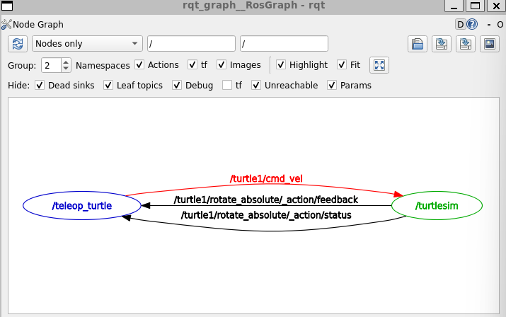
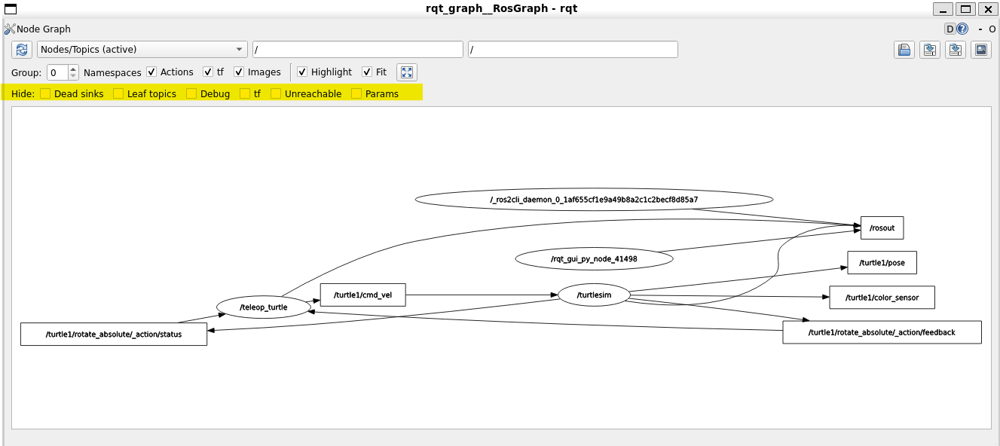

# ROS Primer
Reference notes to understand ROS architecture and components.

### Setting Up ROS
Need to source the bash file so that it setups up environment variables that allows ROS to function:
```sh
source /opt/ros/humble/setup.bash
```

To view the environement variables use the command:
```sh
printenv | grep -i ROS
```

Key environment variables to check are:
```
ROS_VERSION=2
ROS_PYTHON_VERSION=3
ROS_DISTRO=humble
```

Set ROS to only communicate within `localhost`:
```sh
export ROS_LOCALHOST_ONLY=1
```

### Turtlesim
Turtlesim is a lightweight simulator to show what ROS can do.

Install with:
```sh
sudo apt install ros-humble-turtlesim
```

Check packages to confirm installation with:
```sh
ros2 pkg executables turtlesim
```

- `ros2`: Can use to start nodes, set paramaters, listen to topics.
- `rqt`: GUI tool that represents all the command line options of ROS.

Start turtlesim with:
```sh
ros2 run turtlesim turtlesim_node
```

Start a node to control the turtle:
```sh
ros2 run turtlesim turtle_teleop_key
```

### Viewing active topics, services and actions
```sh
ros2 nodelist

ros2 topic list

ros2 service list

ros2 action list
```

### Using `rqt`
Install `rqt` with:
```sh
sudo apt install '~nros-humble-rqt*'
```

Run `rqt` with:
```sh
rqt
```

From the menu select `Plugins > Services > Service Caller`

## Nodes
Each node in ROS should be responsible for a single, modular purpose. Nodes can send and receive data from other nodes via `topics`, `services`, `actions`, or `parameters`. A full robotic system is comprised of many nodes working in concert. In ROS 2, a single executable (C++ program, Python program, etc.) can contain one or more nodes.

Examples: 
- controlling the wheel motors
- publishing the sensor data 


### Turtleism Example
Start the main node:
```sh
ros2 run turtlesim turtlesim_node
```
See the names of all running nodes. This is especially useful when you want to interact with a node, or when you have a system running many nodes and need to keep track of them:
```sh
ros2 node list
```
Start another node:
```sh
ros2 run turtlesim turtle_teleop_key
```
Access information ( list of subscribers, publishers, services, and actions. i.e. the ROS graph connections that interact with that node.) on a node:
```sh
ros2 node info <node_name>
```

## Topics
Topics act as data bus for nodes to exchange messages


A node may publish data to any number of topics and simultaneously have subscriptions to any number of topics.


Topics are one of the main ways in which data is moved between nodes and therefore between different parts of the system.

### Turtleism Example
Run this in one terminal:
```sh
ros2 run turtlesim turtlesim_node
```
Run this in another terminal:
```sh
ros2 run turtlesim turtle_teleop_key
```

#### Graphical Introspection
Run this in another graph to open `rqt` (make sure to deactivate `conda` if needed `conda deactivate`):
```sh
ros2 run rqt_graph rqt_graph
```



The `/teleop_turtle node` is publishing data (the keystrokes you enter to move the turtle around) to the `/turtle1/cmd_vel topic`, and the `/turtlesim node` is subscribed to that topic to receive the data.

#### Terminal Introspection
Return a list of all the topics currently active in the system:
```sh
ros2 topic list
```
Returns:
```
/parameter_events
/rosout
/turtle1/cmd_vel
/turtle1/color_sensor
/turtle1/pose
```
Return the same list of topics, this time with the topic type appended in brackets:
```sh
ros2 topic list -t
```
Returns:
```
/parameter_events [rcl_interfaces/msg/ParameterEvent]
/rosout [rcl_interfaces/msg/Log]
/turtle1/cmd_vel [geometry_msgs/msg/Twist]
/turtle1/color_sensor [turtlesim/msg/Color]
/turtle1/pose [turtlesim/msg/Pose]
```
To see this graphically, uncheck hide in `rqt`:


#### See Published Data
```sh
ros2 topic echo <topic_name>
```

Since we know that /teleop_turtle publishes data to /turtlesim over the /turtle1/cmd_vel topic, let’s use echo to introspect that topic:
```sh
ros2 topic echo /turtle1/cmd_vel
```
Returns:
```
linear:
  x: 2.0
  y: 0.0
  z: 0.0
angular:
  x: 0.0
  y: 0.0
  z: 0.0
---
linear:
  x: 0.0
  y: 0.0
  z: 0.0
angular:
  x: 0.0
  y: 0.0
  z: 2.0
```
See a summary of publisher/subscriber counts:
```sh
ros2 topic info /turtle1/cmd_vel
```
To look at the details of a type of message we use:
```sh
ros2 interface show <msg_type>
```
For example:
```sh
ros2 interface show geometry_msgs/msg/Twist
```
Returns:
```
# This expresses velocity in free space broken into its linear and angular parts.

Vector3  linear
        float64 x
        float64 y
        float64 z
Vector3  angular
        float64 x
        float64 y
        float64 z
```
Recall this is what we saw being transmitted when we called echo on the topic teleop uses.

Can manually/directly publish data to a topic via command:
```sh
ros2 topic pub <topic_name> <msg_type> '<args>'
```
Example for turtlesim:
```sh
ros2 topic pub /turtle1/cmd_vel geometry_msgs/msg/Twist "{linear: {x: 2.0, y: 0.0, z: 0.0}, angular: {x: 0.0, y: 0.0, z: 1.8}}"
```
You can also view the rate at which data is published using:
```sh
ros2 topic hz /turtle1/pose
```
Returns:
```sh
average rate: 62.474
        min: 0.015s max: 0.017s std dev: 0.00048s window: 64
average rate: 62.472
        min: 0.015s max: 0.017s std dev: 0.00050s window: 127
average rate: 62.497
        min: 0.015s max: 0.017s std dev: 0.00049s window: 190
average rate: 6
```
The bandwidth used by a topic can be viewed using:
```sh
ros2 topic bw /turtle1/pose
```
Returns:
```sh
Subscribed to [/turtle1/pose]
1.50 KB/s from 62 messages
        Message size mean: 0.02 KB min: 0.02 KB max: 0.02 KB
1.51 KB/s from 100 messages
        Message size mean: 0.02 KB min: 0.02 KB max: 0.02 KB
1.50 KB/s from 100 messages
        Message size mean: 0.02 KB min: 0.02 KB max: 0.02 KB
1.51 KB/s from 100
```
To list a list of available topics of a given type use:
```sh
ros2 topic find <topic_type>
```
Example:
```sh
ros2 topic find geometry_msgs/msg/Twist
```
Returns:
```
/turtle1/cmd_vel
```

## Services
Services only provide data when they are specifically called by a client.


Find type of a service:
```sh
ros2 service type <service_name>
```

Example to look at turtlesim's /clear service:
```sh
ros2 service type /clear
```
Returns:
```
std_srvs/srv/Empty
``

To see the types of all the active services at the same time:
```sh
ros2 service list -t
```

Find all the services of a specific type:
```sh
ros2 service find <type_name>
```

Example to find all empty type services:
```
ros2 service find std_srvs/srv/Empty
```
Returns:
```
/clear
/reset
```

Structure of the input arguments for a service type:
```sh
ros2 interface show <type_name>
```

Example inputs for Spawn service:
```sh
ros2 interface show turtlesim/srv/Spawn
```
Returns:
```
float32 x
float32 y
float32 theta
string name # Optional.  A unique name will be created and returned if this is empty
---
string name
```

Can call a service using:
```sh
ros2 service call <service_name> <service_type> <arguments>
```


## Parameters

## Actions